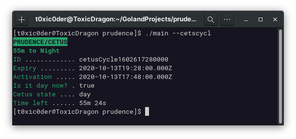
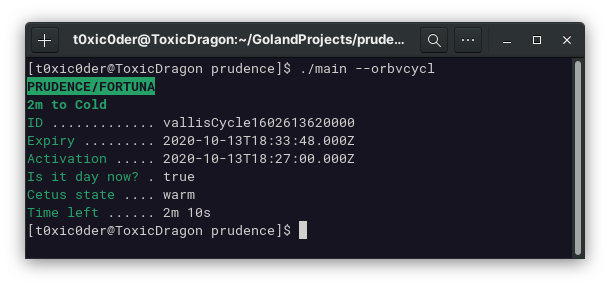
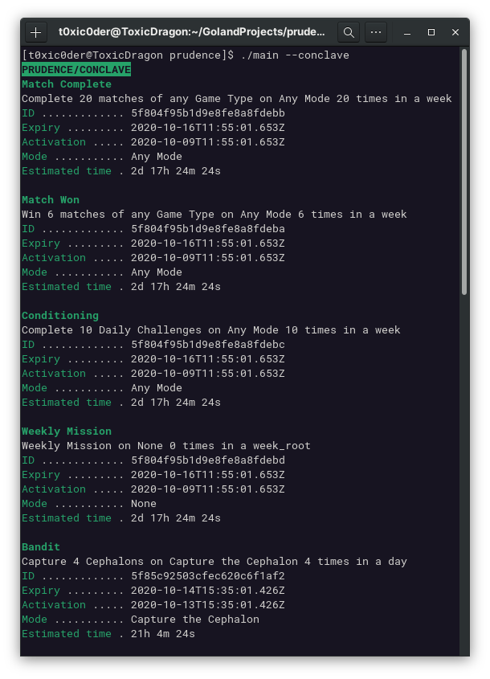
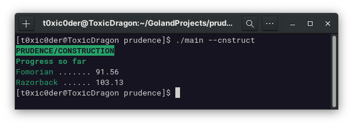
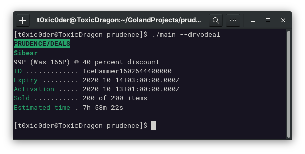

# prudence

An easy application to help me know when night falls at PoE so I can hunt eidolons 

## Screenshots

- Know the state of Plains of Eidolon

- Know the state of Orb Vallis

- Know the details about Conclave

- Know the progress of construction

- Know the deals available from Darvo
